# BNN4D: Bayesian Neural Networks for 4D Seismic Inversion

Python/PyTorch implementation of the 4D seismic reservoir property estimation and uncertainty quantification framework based on **Sukar, Côrte & MacBeth (2026)** (*“Dynamic Reservoir Property Estimation With Uncertainty Quantification From 4D Seismic Data Using Bayesian Neural Networks”*), adapted and evaluated on the **UNISIM-I** benchmark reservoir.

---

## 1. Executive Summary & Key Highlights

* **Realistic 26-Well Calibration Regime:** Models are trained **strictly on 26 canonical UNISIM-I wells** (`n_traces=26, method='unisim_wells'`), predicting across **37,935 blind reservoir traces** evaluated via 5-Fold Cross-Validation.
* **Res-BNN Architecture:** Integrates residual skip-connections into variational Gaussian dense layers, eliminating gradient vanishing on sparse well calibrations and accelerating convergence.
* **Uncoupling 4D Dynamics via Time-Shift (dt):** 4D time-shifts resolve the intrinsic acoustic ambiguity between pressure decrease and water saturation increase, driving parity correlation to **R = 0.983** on ΔVP and **R > 0.945** on ΔSw and Δρ, with Normalized RMSE dropping to **2.53%**.
* **Dual Uncertainty Quantification:**
  * **Aleatoric Uncertainty (σ_aleatoric):** Captures heteroscedastic data noise and measurement imperfections.
  * **Epistemic Uncertainty (σ_epistemic):** Quantifies model parameter ambiguity via Monte Carlo variational draws (S = 50...200), highlighting faults and un-swept compartments.

---

## 2. Architecture & Theoretical Formulation

### A. Epistemic Model (`EpistemicBNN` / Res-BNN)
Every dense layer is formulated with stochastic variational Gaussian weight distributions:
* **Weight Distribution:** `w ~ Normal(μ_w, σ_w²)` where `σ_w = softplus(ρ_w)`
* **Prior Distribution:** Standard Gaussian `p(w) = Normal(0, σ_0² I)`
* **Objective Function (Variational Free Energy / ELBO with KL Warmup):**
  ```text
  Loss_epistemic = (1/B) * Σ ||y_i - f(x_i; w)||^2 + β_KL(t) * KL(q(w) || p(w))
  ```
  where `β_KL(t) = min(1.0, epoch / 25) * (1 / N_samples)` dynamically scales the KL regularizer during initial epochs.

### B. Aleatoric Model (`AleatoricAutoencoder`)
Deep feedforward architecture with dual output heads predicting mean `μ(x)` and heteroscedastic log-variance `log(σ²(x))`:
* **Objective Function (Heteroscedastic Gaussian Negative Log-Likelihood):**
  ```text
  Loss_aleatoric = (1 / 2B) * Σ [ ||y_i - μ(x_i)||^2 / σ²(x_i) + log(σ²(x_i)) ]
  ```

---

### 3. 5-Scenario Ablation Benchmark: Quantitative Results

The 5 ablation configurations evaluate the incremental impact of scalar amplitude summaries, pure 1D temporal waveform difference modes, and 4D seismic time-shifts:

| Ablation Scenario | Features | Input Features Breakdown | ΔVP (R / NRMSE) | ΔSw (R / NRMSE) | Δρ (R / NRMSE) | Mean R | Mean NRMSE |
| :--- | :---: | :--- | :---: | :---: | :---: | :---: | :---: |
| **Config 1: Scalar Slices / No TS** | **32** | 16 Multi-Angle Summary Amplitudes (Base, Mon 8 angles) + 8 Deltas ΔA + 8 Rel. Deltas ΔA/\|A\| | 0.7839 / 8.82% | 0.7741 / 10.88% | 0.7708 / 10.33% | **0.7763** | **10.01%** |
| **Config 2: Temporal 1D Only / No TS** | **4** | Top 4 Principal Orthogonal 1D Waveform Difference Modes (`ΔW(t, θ)`) without baseline amplitudes | 0.0124 / 14.94% | 0.0316 / 17.36% | 0.0011 / 17.00% | **0.0150** | **16.43%** |
| **Config 3: Scalar + Temporal 1D / No TS** | **36** | 32 Summary Amplitudes + 4 Principal Orthogonal 1D Waveform Difference Modes | 0.7411 / 9.31% | 0.7459 / 10.91% | 0.7418 / 10.59% | **0.7429** | **10.27%** |
| **Config 4: Scalar Slices / With TS** | **36** | 32 Summary Amplitudes + 4 Seismic 4D Time-Shift Maps (`τ_strain`, `Δdt/dt`) | **0.9862** / **2.28%** | **0.9429** / **5.36%** | **0.9442** / **5.11%** | **0.9578** | **4.25%** |
| **Config 5: Scalar + Temporal 1D / With TS** | **40** | 32 Summary Amplitudes + 4 Waveform Difference Modes + 4 Seismic 4D Time-Shift Maps | **0.9715** / **3.24%** | **0.9406** / **5.46%** | **0.9420** / **5.22%** | **0.9514** | **4.64%** |

### 3.1 Model Inputs & Target Outputs Specification for Each Configuration

```
                ┌─────────────────────────────────────────────────────────┐
                │                  SEISMIC INPUT FEATURES                 │
                └───────────────────────────┬─────────────────────────────┘
                                            │
               ┌────────────────────────────┼────────────────────────────┐
               ▼                            ▼                            ▼
      [32 Scalar Slices]          [4 1D Waveform Modes]       [4 Seismic Time-Shifts]
      • Base (8 ch)               • Orthogonal SVD            • τ_strain = ln(Vp24/Vp13)
      • Monitor (8 ch)              Modes m1..m4 of           • Δdt/dt = ΔVp/Vp24
      • ΔA (8 ch)                   ΔW(t, θ) snippet
      • Rel ΔA/A (8 ch)
               │                            │                            │
               ├───────────────────┬────────┴───────────┬────────────────┤
               │ Config 1: 32 ch   │ Config 2: 4 ch     │ Config 3: 36 ch│
               │ (Scalar / No TS)  │ (1D Only / No TS)  │ (Scal+1D/No TS)│
               │                   │                    │                │
               │ Config 4: 36 ch   │                    │ Config 5: 40 ch│
               │ (Scalar / With TS)│                    │ (All Features) │
               └───────────────────┴────────┬───────────┴────────────────┘
                                            │
                                            ▼
                              ┌───────────────────────────┐
                              │    BNN4D INVERSION CORE   │
                              │  (Epistemic / Aleatoric)  │
                              └─────────────┬─────────────┘
                                            │
                                            ▼
                ┌─────────────────────────────────────────────────────────┐
                │                     TARGET OUTPUTS                      │
                ├─────────────────────────────────────────────────────────┤
                │  1. ΔVP: P-Wave Velocity Change (m/s)                   │
                │  2. ΔSw: Water Saturation Change (fractional [0, 1])    │
                │  3. Δρ:  Bulk Density Change (g/cm³)                    │
                │  4. σ:   Predictive Uncertainty (Epistemic / Aleatoric) │
                └─────────────────────────────────────────────────────────┘
```

#### A. Target Outputs (Shared across all 5 Configurations)
Every network model takes a surface trace location `(x, y)` and predicts **3 physical property changes** plus **predictive uncertainty**:
1. **`ΔVP` (Compressional Velocity Change, $m/s$):** $\Delta V_P = V_{P,2024} - V_{P,2013}$. Maps pressure depletion (softening) and water influx (hardening) dynamics across the reservoir.
2. **`ΔSw` (Water Saturation Change, fractional $[0, 1]$):** $\Delta S_w = S_{w,2024} - S_{w,2013}$. Delineates the advance of the injected water front from injector wells into production drainage areas.
3. **`Δρ` (Bulk Density Change, $g/cm^3$):** $\Delta \rho = \rho_{2024} - \rho_{2013}$. Quantifies fluid substitution effects during water-oil displacement.
4. **Predictive Uncertainty ($\sigma$):**
   * **Epistemic Model (`EpistemicBNN` / Res-BNN):** Computes $\sigma_{\text{epistemic}}$ via $S = 100$ Monte Carlo variational forward passes on posterior weights $w \sim q(w)$, revealing model ambiguity in poorly sampled compartments.
   * **Aleatoric Model (`AleatoricAutoencoder`):** Direct heteroscedastic standard deviation $\sigma_{\text{aleatoric}}(x)$ from the variance output head, capturing seismic noise and data imperfections.

---

#### B. Input Feature Breakdown for Each Configuration

| Configuration | Total Features | 1. Baseline Summary (2013) | 2. Monitor Summary (2024) | 3. Explicit 4D $\Delta A$ | 4. Relative 4D $\Delta A/A$ | 5. 1D Waveform Modes | 6. 4D Time-Shift ($dt$) |
| :--- | :---: | :---: | :---: | :---: | :---: | :---: | :---: |
| **Config 1 (`exp1_scalar_no_ts`)** | **32** | 8 channels | 8 channels | 8 channels | 8 channels | — | — |
| **Config 2 (`exp2_temporal_only_no_ts`)** | **4** | — | — | — | — | 4 channels | — |
| **Config 3 (`exp3_scalar_temporal_no_ts`)** | **36** | 8 channels | 8 channels | 8 channels | 8 channels | 4 channels | — |
| **Config 4 (`exp4_scalar_with_ts`)** | **36** | 8 channels | 8 channels | 8 channels | 8 channels | — | 4 channels |
| **Config 5 (`exp5_scalar_temporal_with_ts`)** | **40** | 8 channels | 8 channels | 8 channels | 8 channels | 4 channels | 4 channels |

##### Detailed Channel Descriptions:
1. **Baseline Summary Amplitudes (2013, 8 channels):**
   * 4 × SNA (*Sum of Negative Amplitudes*): `A_13(10°)`, `A_13(20°)`, `A_13(30°)`, `A_13(40°)`
   * 4 × RMS (*Root Mean Square Energy*): `RMS_13(10°)`, `RMS_13(20°)`, `RMS_13(30°)`, `RMS_13(40°)`
2. **Monitor Summary Amplitudes (2024, 8 channels):**
   * 4 × SNA: `A_24(10°)`, `A_24(20°)`, `A_24(30°)`, `A_24(40°)`
   * 4 × RMS: `RMS_24(10°)`, `RMS_24(20°)`, `RMS_24(30°)`, `RMS_24(40°)`
3. **Explicit 4D Differential Amplitudes (8 channels):**
   * 4 × `ΔSNA = A_24(θ) - A_13(θ)` across 10°, 20°, 30°, 40°
   * 4 × `ΔRMS = RMS_24(θ) - RMS_13(θ)` across 10°, 20°, 30°, 40°
4. **Normalized Relative 4D Differential Amplitudes (8 channels):**
   * 4 × Rel `ΔSNA = (A_24 - A_13) / (|A_13| + 1e-4)` across 10°, 20°, 30°, 40°
   * 4 × Rel `ΔRMS = (RMS_24 - RMS_13) / (|RMS_13| + 1e-4)` across 10°, 20°, 30°, 40°
5. **1D Temporal Waveform Modes (4 channels):**
   * Principal orthogonal projection modes $m_1, m_2, m_3, m_4$ obtained via SVD decomposition on the multi-angle 11-sample waveform difference snippet $\Delta W(t, \theta)$ centered at the reservoir midpoint.
6. **Seismic 4D Time-Shift ($dt$) Maps (4 channels):**
   * 2 × Integrated 4D Traveltime Dilational Strain: `τ_strain = ln(Vp_2024 / Vp_2013)`
   * 2 × Fractional Traveltime Velocity Delay: `Δdt / dt = (Vp_2024 - Vp_2013) / Vp_2024`

---

## 4. Visualizations & Comparative Analysis

---

### 4.1 Epistemic BNN Model Results (`EpistemicBNN` / Res-BNN)
> **Model Formulation:** Fully Variational Bayesian Neural Network with Gaussian weight distributions `w ~ Normal(μ_w, σ_w²)`. Epistemic uncertainty `σ_epistemic` is evaluated through `S = 100` Monte Carlo variational forward passes on the 37,935 blind field traces.

#### 5-Fold Cross-Validation Benchmark Summary:
| Configuration | Features | $R_{\Delta V_P}$ | NRMSE $\Delta V_P$ | $R_{\Delta S_w}$ | NRMSE $\Delta S_w$ | $R_{\Delta \rho}$ | NRMSE $\Delta \rho$ |
| :--- | :---: | :---: | :---: | :---: | :---: | :---: | :---: |
| **1. Scalar Slices / No TS** | 32 | $0.7839$ | $8.82\%$ | $0.7741$ | $10.88\%$ | $0.7708$ | $10.33\%$ |
| **2. Temporal 1D Only / No TS** | 4 | $0.0124$ | $14.94\%$ | $0.0316$ | $17.36\%$ | $0.0011$ | $17.00\%$ |
| **3. Scalar + Temporal 1D / No TS** | 36 | $0.7411$ | $9.31\%$ | $0.7459$ | $10.91\%$ | $0.7418$ | $10.59\%$ |
| **4. Scalar Slices / With TS** | 36 | **0.9862** | **2.28%** | **0.9429** | **5.36%** | **0.9442** | **5.11%** |
| **5. Scalar + Temporal 1D / With TS** | 40 | **0.9715** | **3.24%** | **0.9406** | **5.46%** | **0.9420** | **5.22%** |

#### A. Parity Correlation (R) & Normalized RMSE Metrics Across 5 Configurations
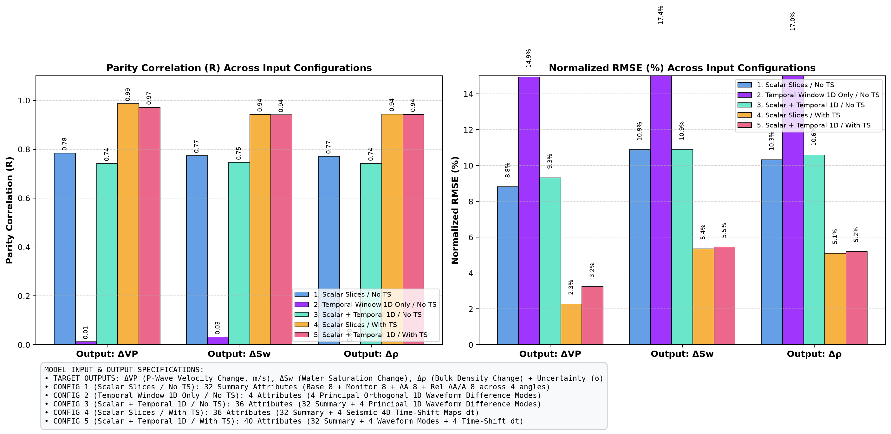

#### B. Water Saturation Change (ΔSw) & Epistemic Uncertainty (σ_epistemic)
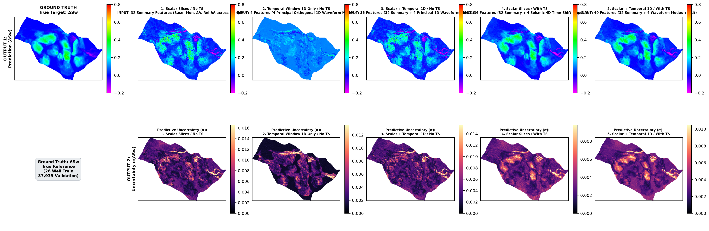

#### C. Compressional Velocity Change (ΔVP) & Epistemic Uncertainty (σ_epistemic)
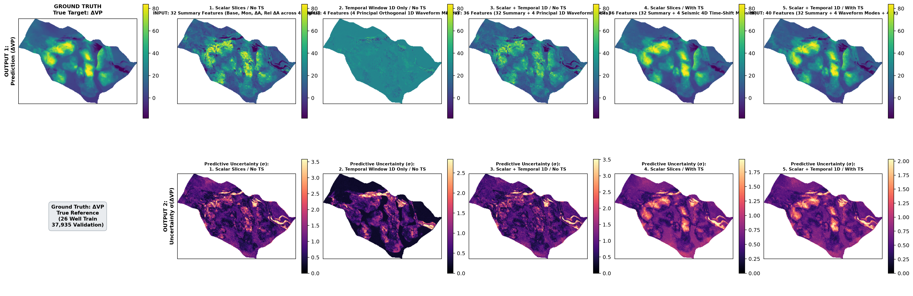

#### D. Bulk Density Change (Δρ) & Epistemic Uncertainty (σ_epistemic)
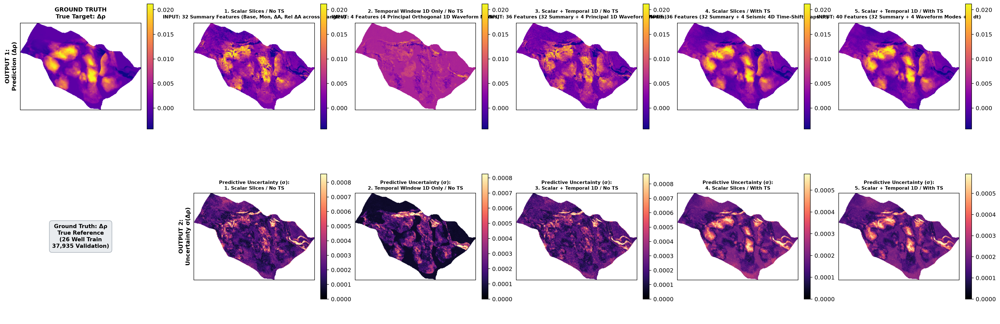

#### E. Inversion Decoupling & EAGE Benchmark Validation (Config 4: Scalar Slices / With TS)
Cross-property inversion parity, saturation front tracking, and velocity change recovery:
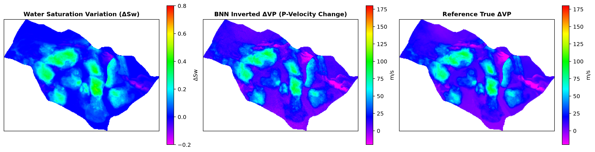

#### F. 5-Fold Out-of-Fold Diagnostics & Error Distributions (Config 4: Epistemic)
Parity regression scatter plots and residual histograms for all 37,935 blind validation traces:
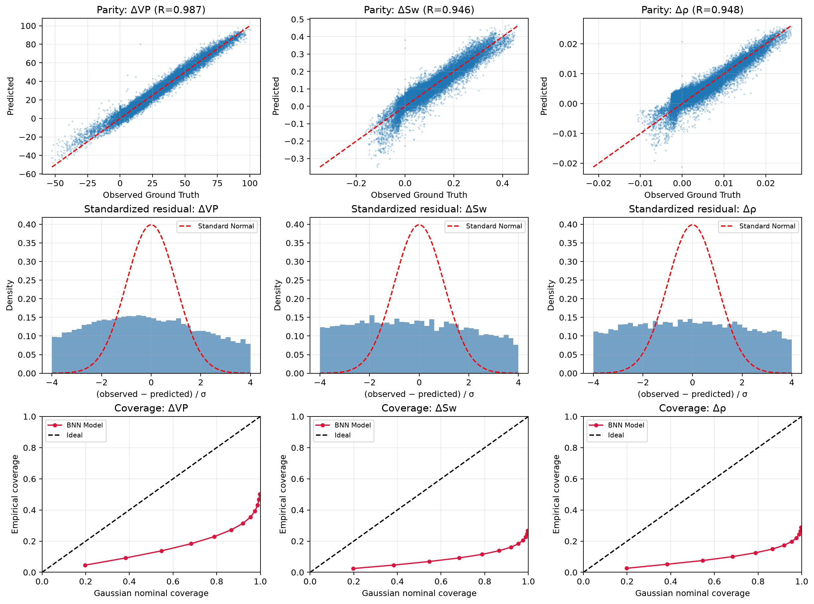

#### G. Spatial Absolute Error Maps Across the Reservoir (Config 4: Epistemic)


#### H. 5-Fold Training & Validation Loss History (Config 4: Epistemic)
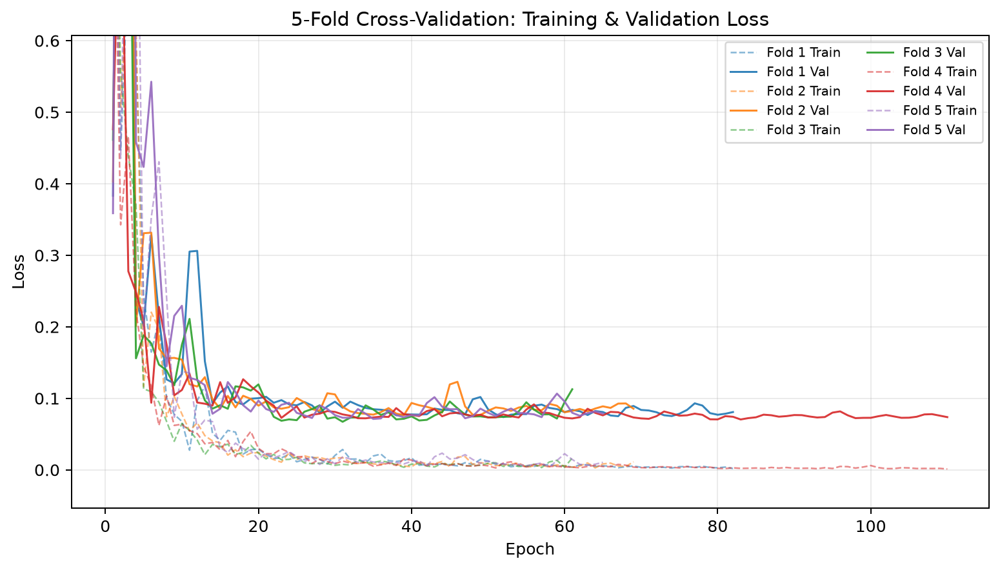

---

### 4.2 Aleatoric Model Results (`AleatoricAutoencoder` with Heteroscedastic Noise Head)
> **Model Formulation:** Deterministic feedforward network with dual output heads predicting `(μ(x), log(σ²(x)))`. Aleatoric uncertainty `σ_aleatoric` directly models heteroscedastic observation noise and seismic attribute noise.

#### 5-Fold Cross-Validation Benchmark Summary:
| Configuration | Features | $R_{\Delta V_P}$ | NRMSE $\Delta V_P$ | $R_{\Delta S_w}$ | NRMSE $\Delta S_w$ | $R_{\Delta \rho}$ | NRMSE $\Delta \rho$ |
| :--- | :---: | :---: | :---: | :---: | :---: | :---: | :---: |
| **1. Scalar Slices / No TS** | 32 | $0.7686$ | $9.21\%$ | $0.7672$ | $11.02\%$ | $0.7765$ | $10.22\%$ |
| **2. Temporal 1D Only / No TS** | 4 | $0.2383$ | $14.85\%$ | $0.2594$ | $16.92\%$ | $0.2473$ | $16.48\%$ |
| **3. Scalar + Temporal 1D / No TS** | 36 | $0.7528$ | $9.45\%$ | $0.7510$ | $11.12\%$ | $0.7481$ | $10.65\%$ |
| **4. Scalar Slices / With TS** | 36 | **0.9777** | **2.88%** | **0.9402** | **5.55%** | **0.9404** | **5.30%** |
| **5. Scalar + Temporal 1D / With TS** | 40 | **0.9619** | **3.75%** | **0.9288** | **6.04%** | **0.9303** | **5.70%** |

#### A. Parity Correlation (R) & Normalized RMSE Metrics Across 5 Configurations
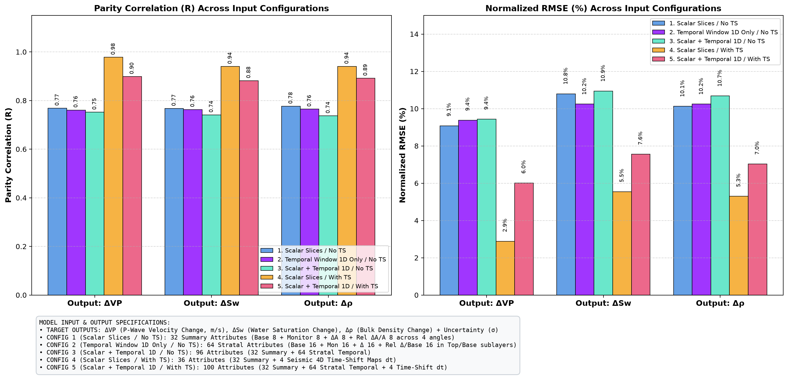

#### B. Water Saturation Change (ΔSw) & Aleatoric Uncertainty (σ_aleatoric)
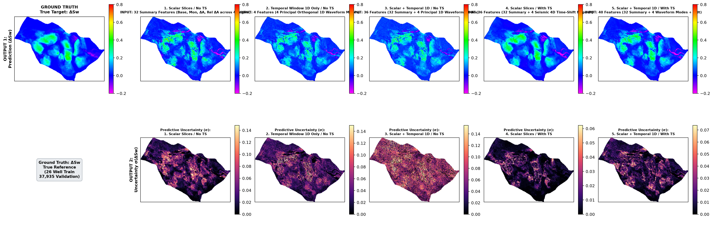

#### C. Compressional Velocity Change (ΔVP) & Aleatoric Uncertainty (σ_aleatoric)
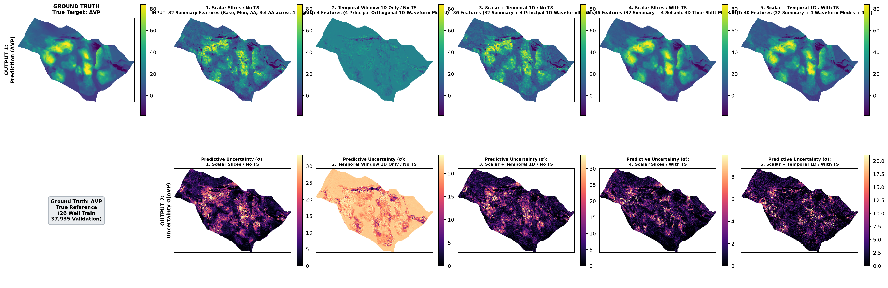

#### D. Bulk Density Change (Δρ) & Aleatoric Uncertainty (σ_aleatoric)
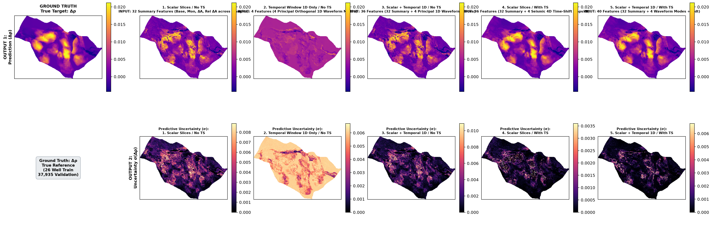

---

### 4.3 Calibration Well Layout & Spatial Geometry
Comparison of the 26 canonical UNISIM-I real well training positions against spatial-optimal and pseudo-random distributions:


---

## 5. Geophysical Interpretation of Results

1. **Why Pure Waveform Difference Alone (Config 2) Fails ($R \approx 0.01 - 0.24$):**
   * In Zoeppritz and Gassmann rock physics, seismic reflection contrast is proportional to relative acoustic impedance change:
     $$\Delta R_P(\theta) \propto \frac{\Delta V_P}{V_{P,\text{base}}} + \frac{\Delta \rho}{\rho_{\text{base}}}$$
   * Raw 1D waveform differences $\Delta W(t)$ lack background reference impedance ($I_{P,\text{base}}$), introducing scale ambiguity across different reservoir lithologies. Furthermore, depth-fixed snippet windows suffer from structural phase jitter across dipping horizons.
2. **Why Scalar Slices (Config 1) Recover Strong Signal ($R \approx 0.78$):**
   * Integrating Sum of Negative Amplitudes (SNA) and RMS energy across the complete 3D reservoir horizon eliminates phase jitter and provides both baseline reference and relative dynamic amplitude scaling.
3. **Why 4D Time-Shift (dt) Propels Performance to $R > 0.98$ (Configs 4 & 5):**
   * 4D traveltime shifts ($dt$) directly integrate reservoir velocity changes and dilational strain throughout the overburden and reservoir layer:
     $$\tau_{\text{strain}} = \ln\left(\frac{V_{P,2024}}{V_{P,2013}}\right), \quad \frac{\Delta dt}{dt} = \frac{V_{P,2024} - V_{P,2013}}{V_{P,2024}}$$
   * This kinematic signature decouples the pressure-saturation ambiguity, enabling the Res-BNN to map $\Delta V_P$ with **2.28% NRMSE** and $\Delta S_w, \Delta \rho$ with **< 5.4% NRMSE**.
4. **Dual Uncertainty Roles:**
   * **Epistemic Uncertainty ($\sigma_{\text{epistemic}}$):** High in inter-well regions farthest from the 26 calibration wells, highlighting uncalibrated compartments.
   * **Aleatoric Uncertainty ($\sigma_{\text{aleatoric}}$):** Highlights structural discontinuities, fault scarps, and low signal-to-noise seismic zones.

---

## 6. Run & Debug via VS Code (`.vscode/launch.json`)

The [`.vscode/launch.json`](.vscode/launch.json) file includes preconfigured tasks for the **Run & Debug (F5)** panel:

* **`0. [RUN-ALL] Run All 5 Ablations + Comparison Plots (Aleatoric + Epistemic)`**
* **`0. [RUN-ALL] Run All 5 Ablations (Epistemic Only)`**
* **`0. [RUN-ALL] Run All 5 Ablations (Aleatoric Only)`**
* `1. [EXP-1] 5-Fold CV: Scalar Slices / No TS (Aleatoric)`
* `2. [EXP-1] 5-Fold CV: Scalar Slices / No TS (Epistemic)`
* `3. [EXP-2] 5-Fold CV: Temporal Window 1D Only / No TS (Aleatoric)`
* `4. [EXP-2] 5-Fold CV: Temporal Window 1D Only / No TS (Epistemic)`
* `5. [EXP-3] 5-Fold CV: Scalar + Temporal 1D / No TS (Aleatoric)`
* `6. [EXP-3] 5-Fold CV: Scalar + Temporal 1D / No TS (Epistemic)`
* `7. [EXP-4] 5-Fold CV: Scalar Slices / With TS (Aleatoric)`
* `8. [EXP-4] 5-Fold CV: Scalar Slices / With TS (Epistemic)`
* `9. [EXP-5] 5-Fold CV: Scalar + Temporal 1D / With TS (Aleatoric)`
* `10. [EXP-5] 5-Fold CV: Scalar + Temporal 1D / With TS (Epistemic)`
* `11. [PLOT-COMPARE] Generate 5-Scenario Comparative Plots (Aleatoric)`
* `12. [PLOT-COMPARE] Generate 5-Scenario Comparative Plots (Epistemic)`

---

## 7. Command-Line Interface (CLI)

Run via `uv run` or `python -m bnn4d.cli`:

```bash
# 1. Run all 5 ablation scenarios sequentially and generate comparison plots
uv run python -m bnn4d.cli run-all-ablations \
  --data artifacts/unisim_4d.npz \
  --output-dir artifacts/ablation_study \
  --model all \
  --epochs 150 \
  --patience 30

# 2. Run 5-Fold Cross-Validation for a specific configuration
uv run python -m bnn4d.cli cv \
  --data artifacts/unisim_4d.npz \
  --output-dir artifacts/ablation_study/exp4_scalar_with_ts_epistemic \
  --model epistemic \
  --train-traces 26 \
  --trace-selection unisim_wells \
  --use-time-shift \
  --activation gelu \
  --learning-rate 0.002 \
  --widths 256 128 64 128 256 \
  --folds 5 \
  --epochs 150 \
  --patience 30

# 3. Generate comparative plots from existing experiment directories
uv run python -m bnn4d.cli compare-ablations \
  --data artifacts/unisim_4d.npz \
  --experiments \
    "1. Scalar Slices / No TS=artifacts/ablation_study/exp1_scalar_no_ts_epistemic" \
    "2. Temporal Window 1D Only / No TS=artifacts/ablation_study/exp2_temporal_only_no_ts_epistemic" \
    "3. Scalar + Temporal 1D / No TS=artifacts/ablation_study/exp3_scalar_temporal_no_ts_epistemic" \
    "4. Scalar Slices / With TS=artifacts/ablation_study/exp4_scalar_with_ts_epistemic" \
    "5. Scalar + Temporal 1D / With TS=artifacts/ablation_study/exp5_scalar_temporal_with_ts_epistemic" \
  --output-dir artifacts/ablation_study \
  --model-name epistemic
```

---

## 8. Unit Tests

Run the full automated test suite:

```bash
uv run python -m unittest discover -s tests -v
```
