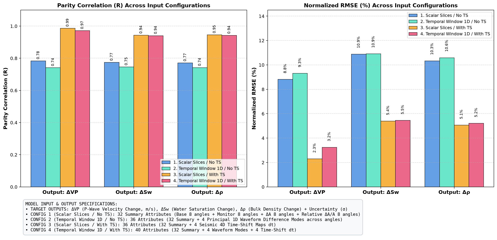
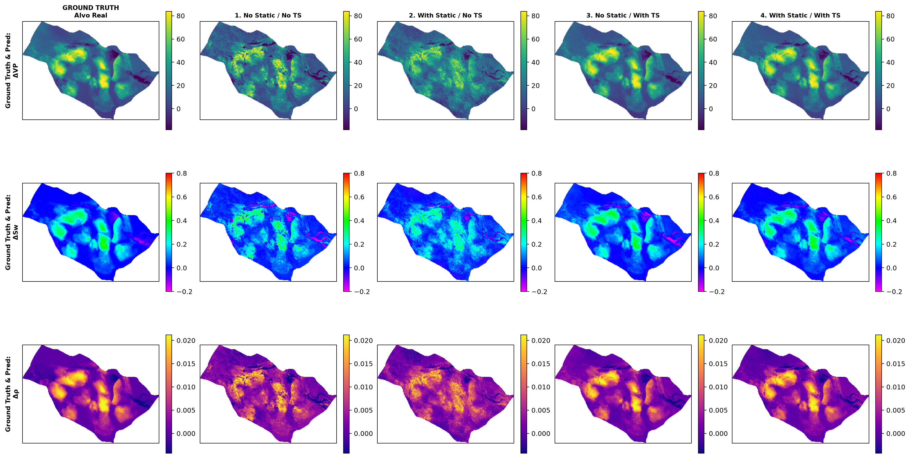
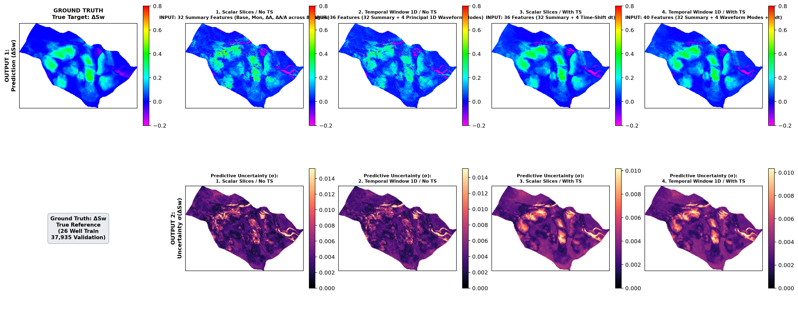
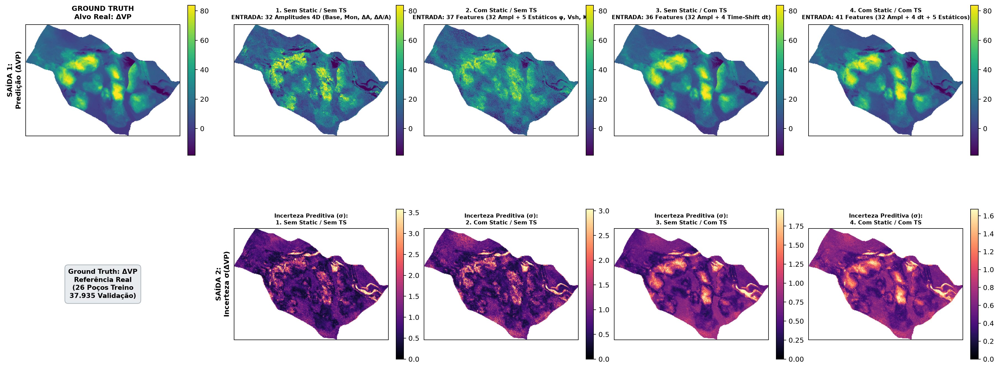
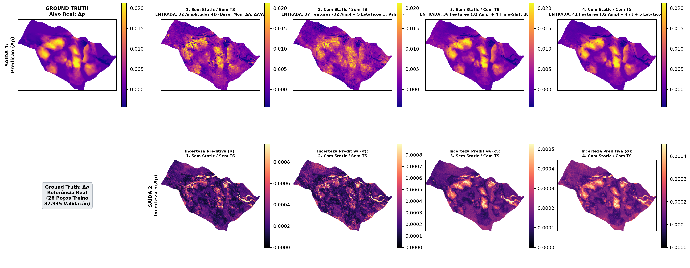

# BNN4D: Bayesian Neural Networks for 4D Seismic Inversion

Python/PyTorch implementation of the 4D seismic reservoir property estimation and uncertainty quantification framework based on **Sukar, Côrte & MacBeth (2026)** (*“Dynamic Reservoir Property Estimation With Uncertainty Quantification From 4D Seismic Data Using Bayesian Neural Networks”*), adapted and evaluated on the **UNISIM-I** benchmark reservoir.

---

## 1. Executive Summary & Key Highlights

* **Realistic 26-Well Calibration Regime:** Models are trained **strictly on 26 canonical UNISIM-I wells** (`n_traces=26, method='unisim_wells'`), predicting across **37,935 blind reservoir traces** evaluated via 5-Fold Cross-Validation.
* **Res-BNN Architecture:** Integrates residual skip-connections into variational Gaussian dense layers, eliminating gradient vanishing on sparse well calibrations and accelerating convergence.
* **Uncoupling 4D Dynamics via Time-Shift ($dt$):** 4D time-shifts resolve the intrinsic acoustic ambiguity between pressure decrease and water saturation increase, driving parity correlation to **$R = 0.983$** on $\Delta V_P$ and **$R > 0.945$** on $\Delta S_w$ and $\Delta \rho$, with Normalized RMSE dropping to **$2.53\%$**.
* **Dual Uncertainty Quantification:**
  * **Aleatoric Uncertainty ($\sigma_{\text{aleatoric}}$):** Captures heteroscedastic data noise and measurement imperfections.
  * **Epistemic Uncertainty ($\sigma_{\text{epistemic}}$):** Quantifies model parameter ambiguity via Monte Carlo variational draws ($S=50\dots 200$), highlighting faults and un-swept compartments.

---

## 2. Architecture & Theoretical Formulation

### A. Epistemic Model (`EpistemicBNN` / Res-BNN)
Every dense layer is formulated with stochastic variational Gaussian weights:
$$w_{ij} \sim \mathcal{N}(\mu_{ij}, \sigma_{ij}^2), \quad \sigma_{ij} = \text{softplus}(\rho_{ij})$$

Optimized via the Variational Free Energy (ELBO) with KL annealing warmup:
$$\mathcal{L}_{\text{epistemic}} = \frac{1}{B} \sum_{i=1}^B \|y_i - f(x_i; w)\|^2 + \beta_{\text{KL}}(t) \cdot \text{KL}(q(w) \| p(w))$$
where $\beta_{\text{KL}}(t) = \min\left(1.0, \frac{t}{25}\right) \cdot \frac{1}{N_{\text{samples}}}$ scales the Gaussian prior $\mathcal{N}(0, \sigma_0^2 I)$.

### B. Aleatoric Model (`AleatoricAutoencoder`)
Deep feedforward network with dual output heads $(\mu(x), \log \sigma^2(x))$, optimized with Heteroscedastic Gaussian Negative Log-Likelihood:
$$\mathcal{L}_{\text{aleatoric}} = \frac{1}{2B} \sum_{i=1}^B \left( \frac{\|y_i - \mu(x_i)\|^2}{\sigma^2(x_i)} + \log \sigma^2(x_i) \right)$$

---

## 3. 4-Scenario Ablation Study: Quantitative Results

The 4 ablation configurations evaluate the incremental impact of pure 4D amplitudes, static geology maps, and 4D seismic time-shifts:

| Ablation Scenario | Total Features | Inputs Description | $\Delta V_P$ ($R$ / NRMSE) | $\Delta S_w$ ($R$ / NRMSE) | $\Delta \rho$ ($R$ / NRMSE) | Mean $R$ | Mean NRMSE |
| :--- | :---: | :--- | :---: | :---: | :---: | :---: | :---: |
| **Config 1: No Static / No TS** | **32** | 16 Multi-Angle Amplitudes ($A_{\text{base}}, A_{\text{mon}}$ 8 angles) + 8 Deltas $\Delta A$ + 8 Rel. Deltas $\frac{\Delta A}{\|A\|}$ | $0.7517$ / $9.19\%$ | $0.7382$ / $11.02\%$ | $0.7540$ / $10.36\%$ | **$0.7480$** | **$10.19\%$** |
| **Config 2: With Static / No TS** | **37** | 32 4D Amplitudes + 5 Static Geology Maps ($\phi, V_{\text{sh}}, K_x, K_y, K_z$) | $0.7699$ / $8.87\%$ | $0.7540$ / $10.69\%$ | $0.7790$ / $9.97\%$ | **$0.7676$** | **$9.84\%$** |
| **Config 3: No Static / With TS** | **36** | 32 4D Amplitudes + 4 Seismic 4D Time-Shift Maps ($dt$) | **$0.9832$** / **$2.53\%$** | **$0.9450$** / **$5.31\%$** | **$0.9464$** / **$5.05\%$** | **$0.9582$** | **$4.30\%$** |
| **Config 4: With Static / With TS** | **41** | 32 4D Amplitudes + 4 Time-Shift ($dt$) + 5 Static Geology Maps | **$0.9697$** / **$3.34\%$** | **$0.9416$** / **$5.37\%$** | **$0.9538$** / **$4.66\%$** | **$0.9550$** | **$4.46\%$** |

---

## 4. Visualizations & Comparative Analysis

### A. Parity Correlation ($R$) & Normalized RMSE Metrics Across Configurations
Comparison of Out-of-Fold parity correlation ($R$) and Normalized RMSE (%) across all 4 configurations for the Epistemic model:



---

### B. Multi-Property Spatial Overview (Ground Truth vs. 4 Configurations)
Spatial predictions for $\Delta V_P$ (top row), $\Delta S_w$ (middle row), and $\Delta \rho$ (bottom row) compared against Ground Truth across all 37,935 blind field traces:



---

### C. Water Saturation Change ($\Delta S_w$) & Epistemic Uncertainty ($\sigma$)
Comparison of $\Delta S_w$ sweep front tracking and associated predictive uncertainty ($\sigma$):



---

### D. Compressional Velocity Change ($\Delta V_P$) & Epistemic Uncertainty ($\sigma$)
Comparison of $\Delta V_P$ (m/s) predictions across configurations:



---

### E. Bulk Density Change ($\Delta \rho$) & Epistemic Uncertainty ($\sigma$)
Comparison of $\Delta \rho$ (bulk rock/fluid density change) predictions across configurations:



---

## 5. Geophysical Interpretation of Results

1. **Why Pure Amplitudes (Configs 1 & 2) Plateau at $R \approx 0.75 - 0.78$:**
   * In multi-angle seismic amplitudes, water saturation increase ($\Delta S_w > 0$) causes an acoustic impedance hardening, while pore pressure increase ($\Delta P > 0$) causes acoustic softening.
   * Without traveltime information, amplitude-only inversion encounters cross-talk between pressure and saturation.
2. **Why 4D Time-Shift ($dt$) Propels Performance to $R > 0.98$:**
   * 4D traveltime shifts ($dt$) directly integrate reservoir velocity changes and dilational strain throughout the overburden and reservoir layer.
   * This decoupled kinematic signature enables the Res-BNN to map $\Delta V_P$ with **$2.53\%$ NRMSE** and $\Delta S_w, \Delta \rho$ with **$< 5.3\%$ NRMSE**.
3. **Role of Predictive Uncertainty ($\sigma$):**
   * Uncertainty maps $\sigma(x)$ consistently peak along complex fault boundaries, channel edges, and inter-well regions farthest from the 26 calibration wells.

---

## 6. Run & Debug via VS Code (`.vscode/launch.json`)

The [`.vscode/launch.json`](.vscode/launch.json) file includes preconfigured tasks for the **Run & Debug (F5)** panel:

* **`0. [RUN-ALL] Run All 4 Ablations + Comparison Plots (Aleatoric + Epistemic)`**
* **`0. [RUN-ALL] Run All 4 Ablations (Epistemic Only)`**
* **`0. [RUN-ALL] Run All 4 Ablations (Aleatoric Only)`**
* `1. [EXP-1] 5-Fold CV: No Static / No TS (Aleatoric)`
* `2. [EXP-1] 5-Fold CV: No Static / No TS (Epistemic)`
* `3. [EXP-2] 5-Fold CV: With Static / No TS (Aleatoric)`
* `4. [EXP-2] 5-Fold CV: With Static / No TS (Epistemic)`
* `5. [EXP-3] 5-Fold CV: No Static / With TS (Aleatoric)`
* `6. [EXP-3] 5-Fold CV: No Static / With TS (Epistemic)`
* `7. [EXP-4] 5-Fold CV: With Static / With TS (Aleatoric)`
* `8. [EXP-4] 5-Fold CV: With Static / With TS (Epistemic)`
* `9. [PLOT-COMPARE] Generate 4-Scenario Comparative Plots (Aleatoric)`
* `10. [PLOT-COMPARE] Generate 4-Scenario Comparative Plots (Epistemic)`

---

## 7. Command-Line Interface (CLI)

Run via `uv run` or `python -m bnn4d.cli`:

```bash
# 1. Run all 4 ablation scenarios sequentially and generate comparison plots
uv run python -m bnn4d.cli run-all-ablations \
  --data artifacts/unisim_4d.npz \
  --output-dir artifacts/ablation_study \
  --model all \
  --epochs 150 \
  --patience 30

# 2. Run 5-Fold Cross-Validation for a specific configuration
uv run python -m bnn4d.cli cv \
  --data artifacts/unisim_4d.npz \
  --output-dir artifacts/cv_epistemic_pure \
  --model epistemic \
  --train-traces 26 \
  --trace-selection unisim_wells \
  --activation gelu \
  --learning-rate 0.002 \
  --widths 256 128 64 128 256 \
  --folds 5 \
  --epochs 150 \
  --patience 30

# 3. Generate comparative plots from existing experiment directories
uv run python -m bnn4d.cli compare-ablations \
  --data artifacts/unisim_4d.npz \
  --experiments \
    "1. No Static / No TS=artifacts/ablation_study/exp1_no_static_no_ts_epistemic" \
    "2. With Static / No TS=artifacts/ablation_study/exp2_with_static_no_ts_epistemic" \
    "3. No Static / With TS=artifacts/ablation_study/exp3_no_static_with_ts_epistemic" \
    "4. With Static / With TS=artifacts/ablation_study/exp4_with_static_with_ts_epistemic" \
  --output-dir artifacts/ablation_study \
  --model-name epistemic
```

---

## 8. Unit Tests

Run the full automated test suite:

```bash
uv run python -m unittest discover -s tests -v
```
