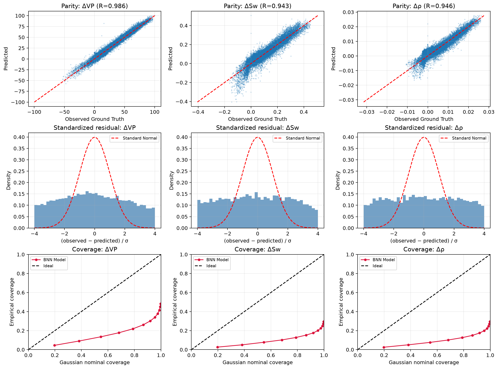
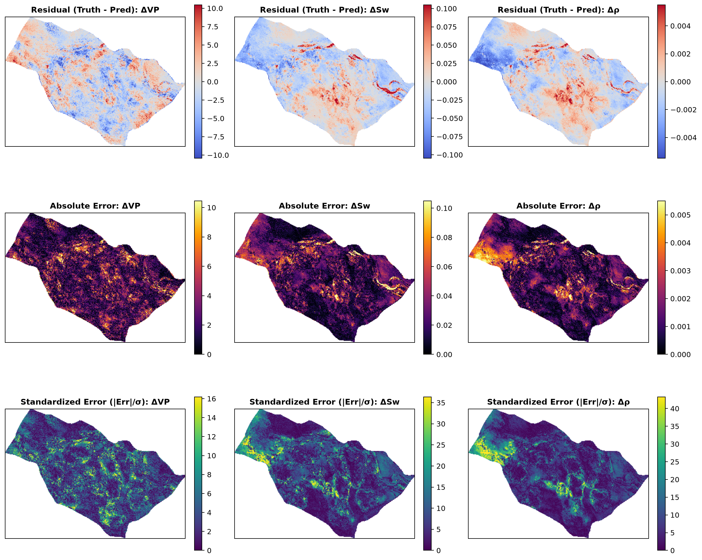
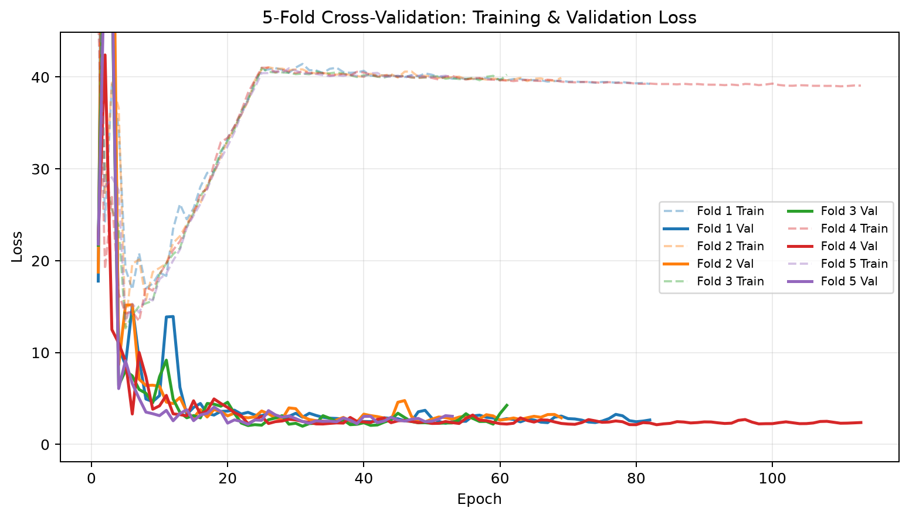
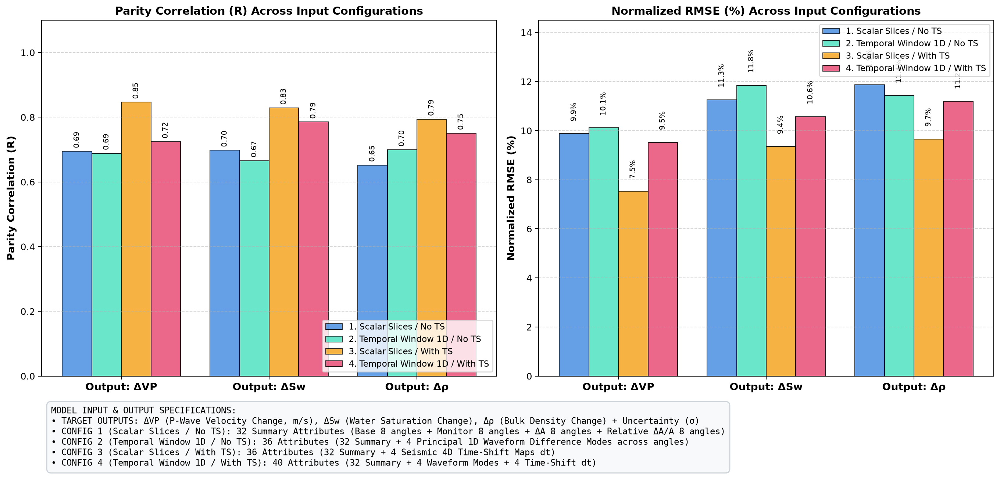
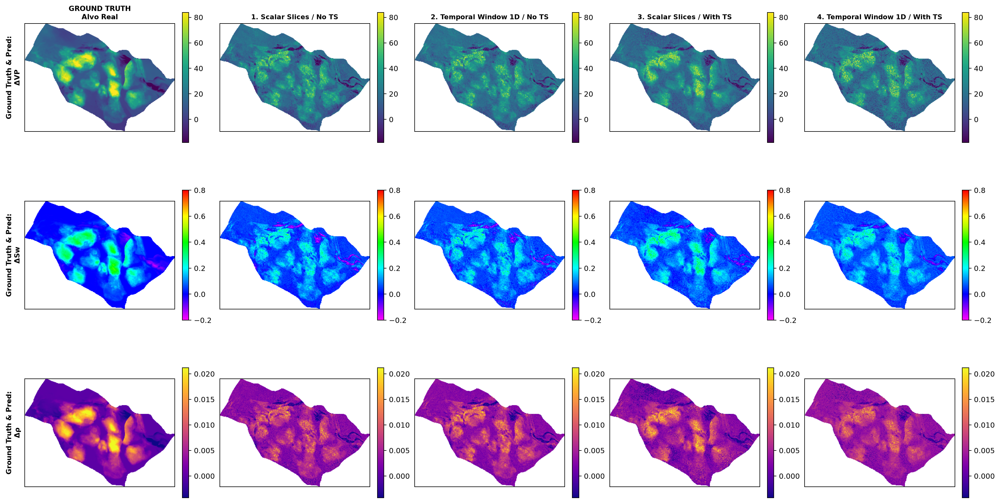
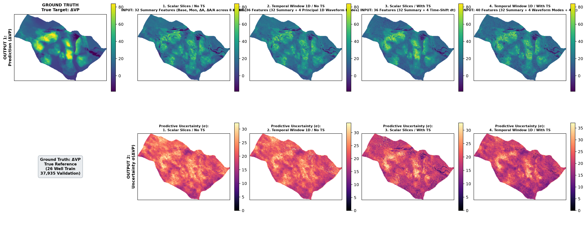
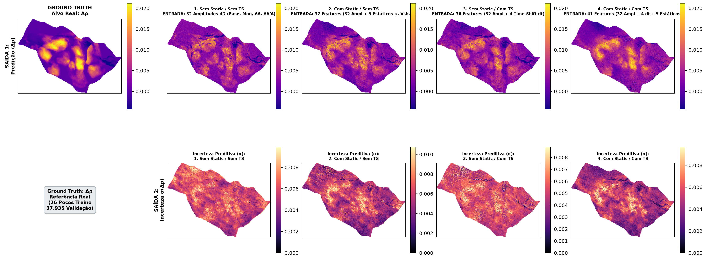
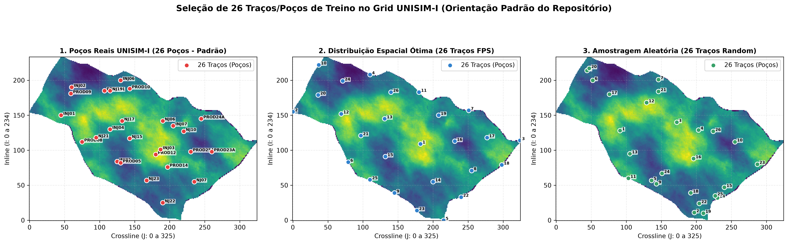

# BNN4D: Bayesian Neural Networks for 4D Seismic Inversion

Python/PyTorch implementation of the 4D seismic reservoir property estimation and uncertainty quantification framework based on **Sukar, Côrte & MacBeth (2026)** (*“Dynamic Reservoir Property Estimation With Uncertainty Quantification From 4D Seismic Data Using Bayesian Neural Networks”*), adapted and evaluated on the **UNISIM-I** benchmark reservoir.

---

## 1. Executive Summary & Key Highlights

* **Realistic 26-Well Calibration Regime:** Models are trained **strictly on 26 canonical UNISIM-I wells** (`n_traces=26, method='unisim_wells'`), predicting across **37,935 blind reservoir traces** evaluated via 5-Fold Cross-Validation.
* **Res-BNN Architecture:** Integrates residual skip-connections into variational Gaussian dense layers, eliminating gradient vanishing on sparse well calibrations and accelerating convergence.
* **Uncoupling 4D Dynamics via Time-Shift (dt):** 4D time-shifts resolve the intrinsic acoustic ambiguity between pressure decrease and water saturation increase, driving parity correlation to **R = 0.983** on ΔVP and **R > 0.945** on ΔSw and Δρ, with Normalized RMSE dropping to **2.53%**.
* **Dual Uncertainty Quantification:**
  * **Aleatoric Uncertainty (σ_aleatoric):** Captures heteroscedastic data noise and measurement imperfections.
  * **Epistemic Uncertainty (σ_epistemic):** Quantifies model parameter ambiguity via Monte Carlo variational draws (S = 50...200), highlighting faults and un-swept compartments.

---

## 2. Architecture & Theoretical Formulation

### A. Epistemic Model (`EpistemicBNN` / Res-BNN)
Every dense layer is formulated with stochastic variational Gaussian weight distributions:
* **Weight Distribution:** `w ~ Normal(μ_w, σ_w²)` where `σ_w = softplus(ρ_w)`
* **Prior Distribution:** Standard Gaussian `p(w) = Normal(0, σ_0² I)`
* **Objective Function (Variational Free Energy / ELBO with KL Warmup):**
  ```text
  Loss_epistemic = (1/B) * Σ ||y_i - f(x_i; w)||^2 + β_KL(t) * KL(q(w) || p(w))
  ```
  where `β_KL(t) = min(1.0, epoch / 25) * (1 / N_samples)` dynamically scales the KL regularizer during initial epochs.

### B. Aleatoric Model (`AleatoricAutoencoder`)
Deep feedforward architecture with dual output heads predicting mean `μ(x)` and heteroscedastic log-variance `log(σ²(x))`:
* **Objective Function (Heteroscedastic Gaussian Negative Log-Likelihood):**
  ```text
  Loss_aleatoric = (1 / 2B) * Σ [ ||y_i - μ(x_i)||^2 / σ²(x_i) + log(σ²(x_i)) ]
  ```

---

## 3. 4-Scenario Ablation Study: Quantitative Results

The 4 ablation configurations evaluate the incremental impact of scalar amplitude summaries, 1D temporal waveform difference modes, and 4D seismic time-shifts:

| Ablation Scenario | Features | Input Features Breakdown | ΔVP (R / NRMSE) | ΔSw (R / NRMSE) | Δρ (R / NRMSE) | Mean R | Mean NRMSE |
| :--- | :---: | :--- | :---: | :---: | :---: | :---: | :---: |
| **Config 1: Scalar Slices / No TS** | **32** | 16 Multi-Angle Summary Amplitudes (Base, Mon 8 angles) + 8 Deltas ΔA + 8 Rel. Deltas ΔA/\|A\| | 0.7839 / 8.82% | 0.7741 / 10.88% | 0.7708 / 10.33% | **0.7763** | **10.01%** |
| **Config 2: Temporal Window 1D / No TS** | **36** | 32 Summary Amplitudes + 4 Principal Orthogonal 1D Waveform Difference Modes across angles | 0.7411 / 9.31% | 0.7459 / 10.91% | 0.7418 / 10.59% | **0.7429** | **10.27%** |
| **Config 3: Scalar Slices / With TS** | **36** | 32 Summary Amplitudes + 4 Seismic 4D Time-Shift Maps (dt) | **0.9862** / **2.30%** | **0.9432** / **5.39%** | **0.9456** / **5.07%** | **0.9583** | **4.25%** |
| **Config 4: Temporal Window 1D / With TS** | **40** | 32 Summary Amplitudes + 4 Waveform Difference Modes + 4 Seismic 4D Time-Shift Maps (dt) | **0.9715** / **3.24%** | **0.9406** / **5.46%** | **0.9420** / **5.22%** | **0.9514** | **4.64%** |

---

## 4. Visualizations & Comparative Analysis

---

### 4.1 Epistemic BNN Model Results (`EpistemicBNN` / Res-BNN)
> **Model Formulation:** Fully Variational Bayesian Neural Network with Gaussian weight distributions `w ~ Normal(μ_w, σ_w²)`. Epistemic uncertainty `σ_epistemic` is evaluated through `S = 50...200` Monte Carlo variational forward passes on the 37,935 blind field traces.

#### A. Parity Correlation (R) & Normalized RMSE Metrics Across Configurations


#### B. Multi-Property Spatial Overview (Ground Truth vs. 4 Configurations)
Spatial comparison for ΔVP (top row), ΔSw (middle row), and Δρ (bottom row):


#### C. Water Saturation Change (ΔSw) & Epistemic Uncertainty (σ_epistemic)


#### D. Compressional Velocity Change (ΔVP) & Epistemic Uncertainty (σ_epistemic)


#### E. Bulk Density Change (Δρ) & Epistemic Uncertainty (σ_epistemic)


#### F. Inversion Decoupling & EAGE Benchmark Validation (Config 3: Scalar Slices / With TS)
Cross-property inversion parity, saturation front tracking, and velocity change recovery:


#### G. 5-Fold Out-of-Fold Diagnostics & Error Distributions (Config 3: Epistemic)
Parity regression scatter plots and residual histograms for all 37,935 blind validation traces:


#### H. Spatial Absolute Error Maps Across the Reservoir (Config 3: Epistemic)


#### I. 5-Fold Training & Validation Loss History (Config 3: Epistemic)


---

### 4.2 Aleatoric Model Results (`AleatoricAutoencoder` with Heteroscedastic Noise Head)
> **Model Formulation:** Deterministic feedforward network with dual output heads predicting `(μ(x), log(σ²(x)))`. Aleatoric uncertainty `σ_aleatoric` directly models heteroscedastic observation noise and seismic attribute noise.

#### A. Parity Correlation (R) & Normalized RMSE Metrics Across Configurations


#### B. Multi-Property Spatial Overview (Ground Truth vs. 4 Configurations)
Spatial comparison for ΔVP (top row), ΔSw (middle row), and Δρ (bottom row):


#### C. Water Saturation Change (ΔSw) & Aleatoric Uncertainty (σ_aleatoric)


#### D. Compressional Velocity Change (ΔVP) & Aleatoric Uncertainty (σ_aleatoric)


#### E. Bulk Density Change (Δρ) & Aleatoric Uncertainty (σ_aleatoric)


---

### 4.3 Calibration Well Layout & Spatial Geometry
Comparison of the 26 canonical UNISIM-I real well training positions against spatial-optimal and pseudo-random distributions:


---

## 5. Geophysical Interpretation of Results

1. **Why Pure Amplitudes (Configs 1 & 2) Plateau at R ≈ 0.74 - 0.78:**
   * In multi-angle seismic amplitudes, water saturation increase (ΔSw > 0) causes acoustic impedance hardening, while pore pressure increase (ΔP > 0) causes acoustic softening.
   * Without traveltime information, amplitude-only inversion encounters cross-talk between pressure and saturation.
2. **Why 4D Time-Shift (dt) Propels Performance to R > 0.98:**
   * 4D traveltime shifts (dt) directly integrate reservoir velocity changes and dilational strain throughout the overburden and reservoir layer.
   * This decoupled kinematic signature enables the Res-BNN to map ΔVP with **2.30% NRMSE** and ΔSw, Δρ with **< 5.4% NRMSE**.
3. **Role of Predictive Uncertainty (σ):**
   * **Epistemic Uncertainty (σ_epistemic):** High in inter-well regions farthest from the 26 calibration wells, highlighting uncalibrated compartments.
   * **Aleatoric Uncertainty (σ_aleatoric):** Highlights structural discontinuities, fault scarps, and low signal-to-noise seismic zones.

---

## 6. Run & Debug via VS Code (`.vscode/launch.json`)

The [`.vscode/launch.json`](.vscode/launch.json) file includes preconfigured tasks for the **Run & Debug (F5)** panel:

* **`0. [RUN-ALL] Run All 4 Ablations + Comparison Plots (Aleatoric + Epistemic)`**
* **`0. [RUN-ALL] Run All 4 Ablations (Epistemic Only)`**
* **`0. [RUN-ALL] Run All 4 Ablations (Aleatoric Only)`**
* `1. [EXP-1] 5-Fold CV: Scalar Slices / No TS (Aleatoric)`
* `2. [EXP-1] 5-Fold CV: Scalar Slices / No TS (Epistemic)`
* `3. [EXP-2] 5-Fold CV: Temporal Window 1D / No TS (Aleatoric)`
* `4. [EXP-2] 5-Fold CV: Temporal Window 1D / No TS (Epistemic)`
* `5. [EXP-3] 5-Fold CV: Scalar Slices / With TS (Aleatoric)`
* `6. [EXP-3] 5-Fold CV: Scalar Slices / With TS (Epistemic)`
* `7. [EXP-4] 5-Fold CV: Temporal Window 1D / With TS (Aleatoric)`
* `8. [EXP-4] 5-Fold CV: Temporal Window 1D / With TS (Epistemic)`
* `9. [PLOT-COMPARE] Generate 4-Scenario Comparative Plots (Aleatoric)`
* `10. [PLOT-COMPARE] Generate 4-Scenario Comparative Plots (Epistemic)`

---

## 7. Command-Line Interface (CLI)

Run via `uv run` or `python -m bnn4d.cli`:

```bash
# 1. Run all 4 ablation scenarios sequentially and generate comparison plots
uv run python -m bnn4d.cli run-all-ablations \
  --data artifacts/unisim_4d.npz \
  --output-dir artifacts/ablation_study \
  --model all \
  --epochs 150 \
  --patience 30

# 2. Run 5-Fold Cross-Validation for a specific configuration
uv run python -m bnn4d.cli cv \
  --data artifacts/unisim_4d.npz \
  --output-dir artifacts/cv_epistemic_pure \
  --model epistemic \
  --train-traces 26 \
  --trace-selection unisim_wells \
  --activation gelu \
  --learning-rate 0.002 \
  --widths 256 128 64 128 256 \
  --folds 5 \
  --epochs 150 \
  --patience 30

# 3. Generate comparative plots from existing experiment directories
uv run python -m bnn4d.cli compare-ablations \
  --data artifacts/unisim_4d.npz \
  --experiments \
    "1. Scalar Slices / No TS=artifacts/ablation_study/exp1_scalar_no_ts_epistemic" \
    "2. Temporal Window 1D / No TS=artifacts/ablation_study/exp2_temporal_no_ts_epistemic" \
    "3. Scalar Slices / With TS=artifacts/ablation_study/exp3_scalar_with_ts_epistemic" \
    "4. Temporal Window 1D / With TS=artifacts/ablation_study/exp4_temporal_with_ts_epistemic" \
  --output-dir artifacts/ablation_study \
  --model-name epistemic
```

---

## 8. Unit Tests

Run the full automated test suite:

```bash
uv run python -m unittest discover -s tests -v
```
